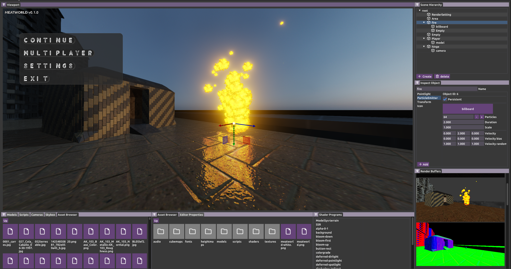
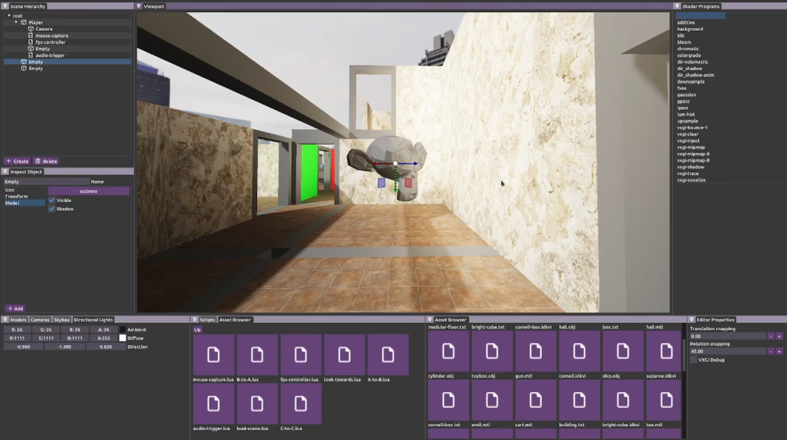
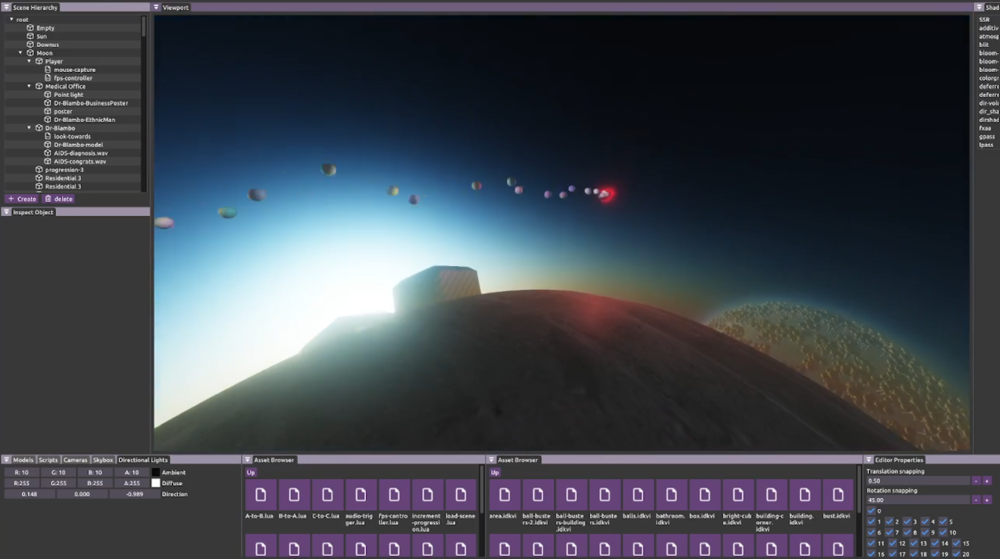
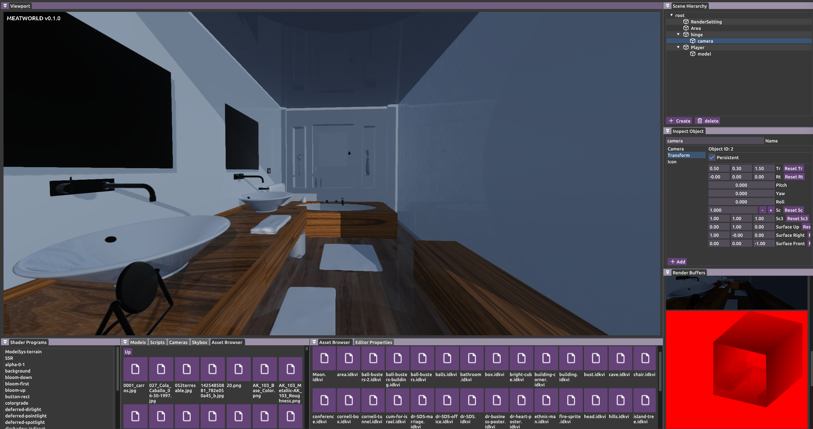

# IDK Game Engine

| | |
|-|-|
|||
|||


##  Dependencies
- [OpenGL Mathematics (glm)](https://github.com/g-truc/glm)
- [OpenGL Extension Wrangler (GLEW)](https://github.com/nigels-com/glew)
- [SDL2](https://github.com/libsdl-org/SDL)
- [SDL_image](https://github.com/libsdl-org/SDL_image)
- [SDL_mixer](https://github.com/libsdl-org/SDL_mixer)


<!-- 
## Building
Running `build.bat` or `build.sh` will generate a folder called `build` in the root directory of the project. 
```
└──IDKGameEngine
    │
    ├── build
    │   └── CMake
    │   └── IDKGE
    │   └── include
    │   └── lib
    │
    ├── IDKGameEngine
    │
    └── libidk
```

- `CMake` contains CMake build files
- `IDKGE` contains resources needed by the engine, it needs to be located next to the final game executable.
- `include` contains the IDKGameEngine headers.
- `lib` contains the IDKGameEngine shared libraries.


## Game Objects
Game objects are represented using integers. Calling `idk::Engine::createGameObject()` will return an integer which can be used to reference an object.

## Component Systems
IDK Engine uses an Entity Component System (ECS) to manage game object properties.


```C++
int main()
{
    idk::Engine engine(1000, 1000);
    const int TRANSFORM = engine.registerCS<Hierarchy_CS>("transform");
    const int PHYSICS   = engine.registerCS<Physics_CS>("physics");
    const int GRABBABLE = engine.registerCS<Grabbable_CS>("grabbable");
    
    int obj1 = idk::ECS2::createGameObject();
    engine.giveComponents(obj1, TRANSFORM, PHYSICS, GRABBABLE);

    /*
        The three component systems can now perform operations on obj1.
    */
}
```

### Stage A and B
The engine will call `idk::ComponentSystem::stage_A()` and `idk::ComponentSystem::stage_B()` at two points during the frame.
| Stage     | Description |
|-----------|-------------|
| stage_A() | Beginning of frame before any internal processes are run. |
| stage_B() | End of frame after engine and rendering logic but before the front and back buffers have been swapped. Mostly useful for UI. |


### ComponentSystem Callbacks
Each callback is run whenever a game object is created, deleted or copied.

- Game object creation
    ```C++
    idk::ComponentSystem::onObjectCreation( int obj_id, idk::Engine & )
    ```


- Game object deletion
    ```C++
    idk::ComponentSystem::onObjectDeletion( int obj_id, idk::Engine & )
    ```


- Game object copy. This is called when one gameobject is created by using another as a prefab: `idk::engine::createGameObject( prefab_id )`
    ```C++
    idk::ComponentSystem::onObjectCopy( int obj_id, idk::Engine & )
    ```


- Game object component assignment. Called when the component system's component is given to the game object.
    ```C++
    idk::ComponentSystem::onComponentAssignment( int obj_id, idk::Engine & )
    ```

### Creating a new Component System
Inherit from `idk::ComponentSystem` to create a new component system. -->
